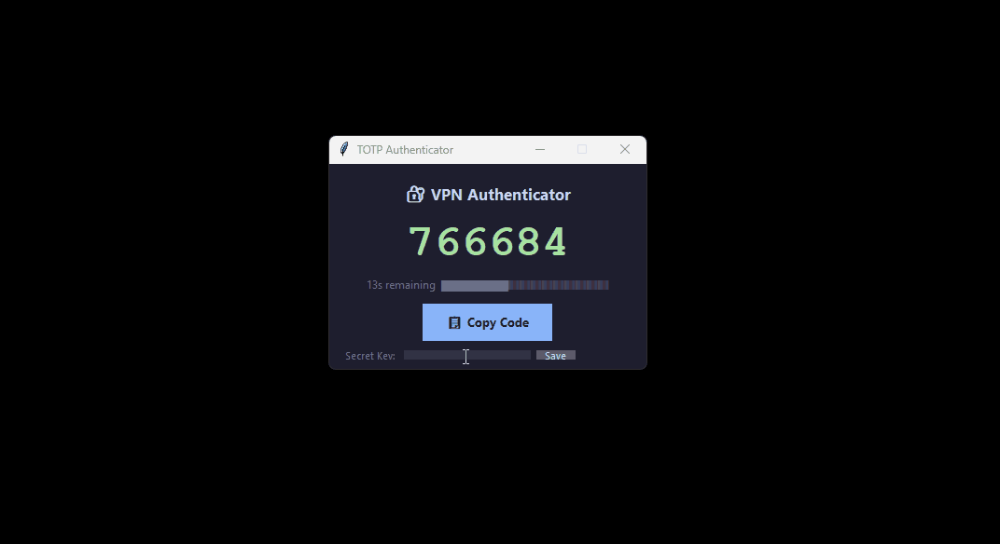

# TOTP Authenticator

[](https://github.com/SilvaHerald/totp-authenticator/actions/workflows/ci.yml)
[](https://opensource.org/licenses/MIT)
[](https://www.python.org/downloads/)

A lightweight, **fully offline** TOTP authenticator for Windows. Get your 2FA codes without reaching for your phone.



## ✨ Features

- 🔢 **Auto-refreshing 6-digit codes** — updates every 30 seconds
- ⏱️ **Countdown timer** — turns red when code is about to expire
- 📋 **One-click copy** — copies code to clipboard instantly
- 💾 **Persistent storage** — saves your secret key for next launch
- 📌 **Always-on-top window** — stays visible while you work
- 🔒 **Fully offline** — zero network calls, your secrets never leave your machine

## 🚀 Getting Started

### Option 1: Download (Recommended)

Download the latest installer from [GitHub Releases](https://github.com/SilvaHerald/totp-authenticator/releases).

### Option 2: Run from Source

```bash
# Clone the repository
git clone https://github.com/SilvaHerald/totp-authenticator.git
cd totp-authenticator

# Create a virtual environment
python -m venv .venv
.venv\Scripts\activate  # Windows

# Install dependencies
pip install -e .

# Run the app
totp-auth
```

### Option 3: Install via pip

```bash
pip install totp-authenticator
totp-auth
```

## 🛠️ Development

```bash
# Install with dev dependencies
pip install -e ".[dev]"

# Run tests
pytest tests/ -v

# Lint code
ruff check src/

# Build executable (requires MSVC or MinGW)
python -m nuitka --onedir --windows-console-mode=disable src/totp_authenticator/main.py
```

## 📦 Project Structure

Please see [PROJECT_STRUCTURE.md](PROJECT_STRUCTURE.md) for a detailed breakdown of the repository.

## 🗺️ Roadmap

Check out our [Roadmap](ROADMAP.md) to see planned features and upcoming updates.

## 🔒 Security & Privacy

Please review our [Security & Privacy Policy](SECURITY_PRIVACY.md) for details on how we keep your 2FA codes safe.

## 🤝 Contributing

Contributions are welcome! Please read the [Contributing Guide](CONTRIBUTING.md) before submitting a Pull Request.

## 📄 License

This project is licensed under the [MIT License](LICENSE).
